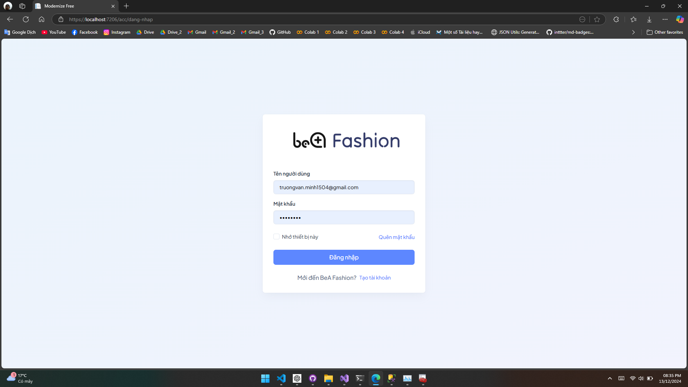
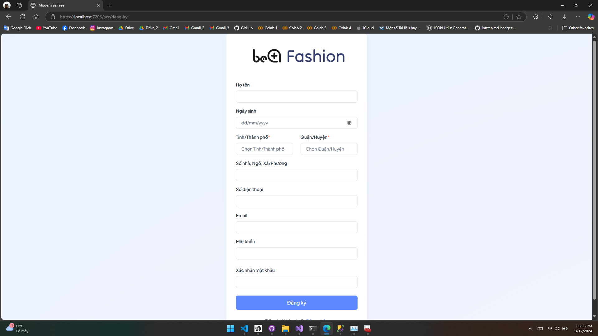

# Fashion Sales Management Website App

This repository contains a web application designed for managing fashion sales efficiently. It offers tools to handle products, customers, orders, and other essential business operations, making it suitable for small to medium-sized fashion retail businesses.

## Features
- **User Authentication:** 
    - Login
    

    - Forgot password
    

    - Register
    
- **Shopping Cart:** Add, remove, and view products.
- **Product Reviews:** Users can leave reviews for products.
- **Payment System:** Supports both online payment and cash on delivery.
- **Role-based Access:** Three roles: customer, employee, and admin.
- **Product Management**: Add, update, delete, and view product details.
- **Customer Management**: Manage customer profiles and purchase histories.
- **Order Management**: Create, update, and track orders, including payment statuses.
- **Reporting**: Generate detailed sales reports for business insights.
- **Role-Based Access Control**: Different permissions for Admin and Employees.
- **Responsive Design**: Optimized for both desktop and mobile devices.

## Technologies Used

- **Backend**: ASP.NET Core MVC
- **Frontend**: HTML, CSS, JavaScript, Bootstrap
- **Database**: SQL Server
- **Tools**: Visual Studio, Entity Framework Core

## Installation

1. Clone the repository:
   ```bash
   git clone https://github.com/Mr-1504/fashion-sales-management-website-app.git
   ```
2. Open the solution in Visual Studio.
3. Restore NuGet packages.
4. Configure the database connection string in `appsettings.json`.
5. Apply migrations to set up the database:
   ```bash
   dotnet ef database update
   ```
6. Run the application:
   ```bash
   dotnet run
   ```

## Usage

1. Open a web browser and navigate to `http://localhost:5000`.
2. Log in using Admin or Employee credentials.
3. Use the dashboard to manage products, customers, and orders.
4. Generate reports for sales analysis.

## Project Structure

- **/Controllers**: Handles application logic and routes.
- **/Views**: Razor pages for the user interface.
- **/Models**: Contains the data models and business logic.
- **/wwwroot**: Static assets like CSS, JavaScript, and images.
- **/Migrations**: Database migration files.

## Contributing

Contributions are welcome! To contribute:

1. Fork the repository.
2. Create a new branch:
   ```bash
   git checkout -b feature-name
   ```
3. Make your changes and commit them:
   ```bash
   git commit -m "Add new feature"
   ```
4. Push to your branch:
   ```bash
   git push origin feature-name
   ```
5. Open a pull request.

## License

This project is licensed under the MIT License. See the `LICENSE` file for details.

## Contact

For questions or support, please contact:

- **Author:** Mr-1504
- **GitHub:** [Mr-1504](https://github.com/Mr-1504)
- **Email:** [truongvan.minh1504@gmail.com](truongvan.minh1504@gmail.com)
